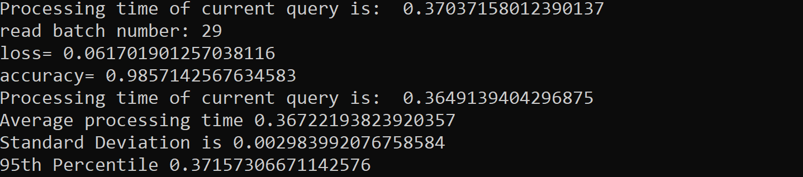

## iDunno Distributed Learning Cluster

# Starting the Server:
>> python3 fserver.py

This will start the Coordinator and a failure detector script (inside node.py to obtain membership list periodically). By default, node-01 is the coordinator always. 

# In this Distributed Learning Cluster, we apply MNIST dataset across two DNN based learning methods; CNN and Multi-Layer Perceptron Models. 

Files:
1. TrainingCNN.py: For Training the CNN model on a node, loads the CNN model (as .h5 file) on the sdfs
2. TrainingMLP.py: For Training the MLP model on a cluster node, loads the MLP model (as .h5 file) on the sdfs
3. TestingMLP.py: Loads the MLP model from sdfs and tests it for incoming query dataset.
4. TestingCNN.py: Loads the CNN model from sdfs and tests it for incoming query dataset. 
5. fmapper.py: This is used to track global file metadata. It stores two mapper structures;  ID mapper: server id -> all stored fids  and File meta info: fid -> DFile 
6. util.py: This is used for implementing basic helper functions to perform consistent hashing on a file, to extract the coordinator node and replica nodes based on the consistent hashing. 
7. node.py: This is the file for detecting failure in the cluster for any node 
8. fserver.py: Coordinator file, schedules jobs(models) across the worker nodes, keeps tracks of the jobs, keeps track of which nodes are alive/failed (using global memership list).  

Communication Protocols Used:
SCP and Sockets

Note that the training phase is already executed and we have stored the training dataset, testing dataset and the models on the sdfs of each VM. Batches of test dataset are created on the sdfs so that when the queries are executed on client, the query will fetch the batch_size of data from the test dataset to run on the model. The batch_size is set as 100 and there are a total of (210 batches i.e. test Dataset size/batch size = 21,000 images/100). To make it work-intensive, we run the queries in a loop. 

Commands for Query:
1. Command to query the MLP model from Coordinator. This will run the TestingMLP.py to query the data increasingly from 1 to 50th batch. This will start the inference stage for MLP.
>> put exec.sh MLP.sh 

2. Command to query the MLP model from Coordinator. This will run the TestingMLP.py to query the data increasingly from 51 to 200th batch. This will start the inference stage for MLP. 
>> put exec3.sh MLP.sh 

3. Command to query the CNN model from Coordinator. This will run the TestingCNN.py to query the data increasingly from 1 to 50th batch. This will start the inference stage for CNN. 
>> put exec1.sh CNN.sh 

4. Command to query the CNN model from Coordinator. This will run the TestingCNN.py to query the data increasingly from 51 to 200th batch. This will start the inference stage for CNN. 
>> put exec2.sh CNN.sh 

# Parallelization for Learning Models
Once the query is submitted to the coordinator, it will choose VMs from the membership list to run the model (i.e. job) simulatanenously depending on the size of the number of batches it has to execute (for smaller query size, less number of VMs and for larger query sizes all VMs from the membership list). These VMs have to be in the membership list of one another and be up and running to be able to get selected for the job by the coordinator.  

# Querying Statistics
As we submit the queries, we compute measures for each of the above aforementioned model/job such as the processing time, the  standard deviation, variance, and 95th percentile . The number of queries executed and the query rate is shown on the worker nodes during the job. Additionally, each time the model is executed the accuracy of the model and loss function values are displayed on the VM.    

# Failure Tolerance
If any of the currently running worker VM node fails , a new membership list is computed by periodic pinging, this allows selecting a new replica, and the model will be executed on the newly selected replica node. Note that the membership list is global and can be viewed by all nodes. For failure of coordinator,  we run the fserver.py on another node (in this case node-02, which is the hot standby in this cluster) to set it as the coordinator to submit new jobs. Note that the currently running jobs on the worker nodes will not be affected even if the coordinator fails as the worker nodes continue to process the previously submitted query in a loop (untill a new query is submitted from a newly selected coordinator node or from the repaired old coordinator node).  

 
